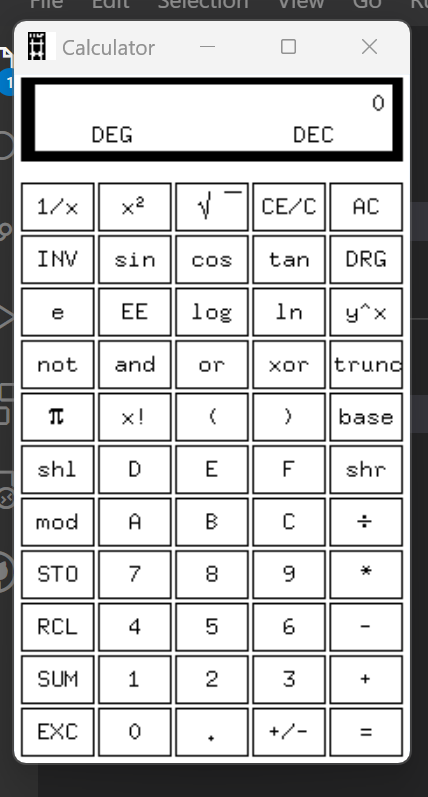

# Getting Started

[WSL(2)](https://learn.microsoft.com/en-us/windows/wsl/about) is the Windows Subsystem for Linux, it allows developers to run a Linux distribution on Windows in such a way that it almost feels like Linux is a native part of Windows.

This is _awesome_ because Windows is by far the best graphical operating system and Linux is by far the best terminal based operating system, so with WSL you get the power of the Linux terminal and the polished usability of Windows.

These days the _only_ way to do development is on Windows through WSL, most people aren't doing it this way, but people who know what they are doing are.

Luckily I've already got WSL properly configured for you (which is not so easy) so most stuff just works, but what doesn't work out of the box is running graphical applications from WSL.

For practical purposes this isn't really an issue because the only graphical applications most people write these days are web based, and web based applications run just fine through WSL: the site is served from within WSL and can be viewed in a web browser like Chrome on the Windows host machine.

However _native_ graphical applications require an X server.

X is a software system that provides the infrastructure for building graphical user interfaces (GUIs) on Unix-like operating systems, including Linux. It allows applications to draw windows, menus, dialog boxes, and other graphical elements on the screen, and provides mechanisms for input events such as mouse and keyboard events.

X provides a client-server architecture, where applications that need to display a GUI run as clients and communicate with a server process that manages the display. The server is responsible for handling low-level input and output operations, managing the display hardware, and coordinating the activities of multiple clients that may be running simultaneously.

X has been a fundamental component of Unix-like systems for several decades and is still widely used today, although newer systems such as Wayland are starting to gain traction as alternatives.

Being a programmer is fundamentally about solving computer based problems. Sometimes that means writing code (quite a lot of the time in fact), but it can also mean configuring a computer operating system.

So the first problem you need to solve is getting an X Server running on Windows so that we can run the turtle code (because turtle is a graphical program - talk about choosing a nightmare problem to start with).

I'm not expecting you to be able to do this, as it is a bit fiddly, but I'm going to give you enough instructions so that it's not completely impossible. If you manage it, it's a serious achievement.

## Steps

1. Install [VcXsrv](https://sourceforge.net/projects/vcxsrv/)
1. Run XLaunch, which should be a shortcut added to your desktop. [This post](https://github.com/microsoft/WSL/issues/4106#issuecomment-502920377) is useful. Disable access control is really important.
1. Open a WSL terminal and type
   
   ```sh
   nano ~/.oh-my-zsh/custom/100-x-for-windows.zsh
   ```

   This opens a command-line text editor, now paste in:

   ```sh
   export DISPLAY=$(ip route list default | awk '{print $3}'):0
   export LIBGL_ALWAYS_INDIRECT=1
   ```

   Save and close (CTRL+X)
1. Reload your `zsh` profile by typing
   ```sh
   exec zsh
   ```
1. Update your `Ubuntu` package repository and upgrade all packages
   ```sh
   sudo apt update && sudo apt upgrade
   ```
   The password it asks for is your Windows password
1. Install some packages to make stuff work
   ```sh
   sudo apt install -y x11-apps python3-tk
   ```
1. Run `xcalc` to test that everything is working.
   
   

Now you can try running the [turtle-1.py](turtle-1.py) script by opening that script and pressing `F5`.

That should keep you busy for a few hours. If you manage to get all that working then try to make some simple shapes in Turtle.